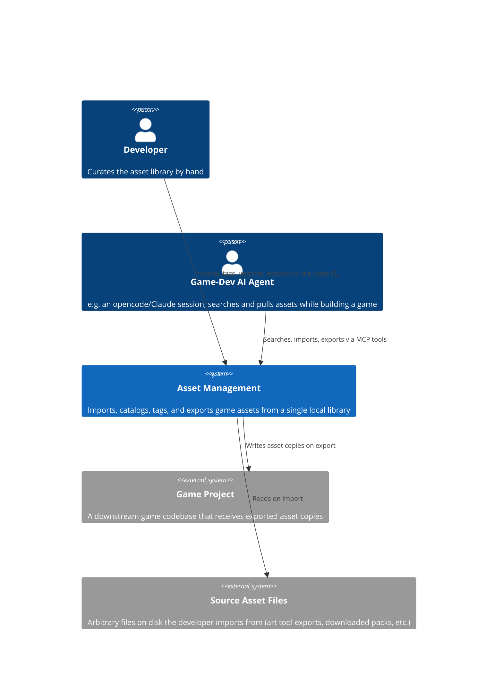

# C4: System Context

## Diagram

## Description

| Actor / System | Type | Relationship to Asset Management |
|---|---|---|
| Developer | Person | Drives curation by hand through the `asset` CLI — import, tag, update, search, export, collection management. |
| Game-Dev AI Agent | Person (via software) | Connects over MCP (stdio) to search the catalog and pull assets into a game project on request; can also import/export/tag, but the intended split is human-drives-curation, agent-drives-consumption. |
| Game Project | External system (black box) | Receives asset copies on export. Asset Management has no live reference back into it — an exported asset is a one-way, disconnected snapshot. Its internals are never modeled here. |
| Source Asset Files | External system (black box) | Arbitrary filesystem locations (art tool output, downloaded asset packs, etc.) that files are imported *from*. Not owned or tracked by Asset Management prior to import. |

Asset Management itself is a single local system — no network services, no multi-tenant concerns. Everything below the System box in this diagram is internal and is broken down in [02-container.md](02-container.md).
