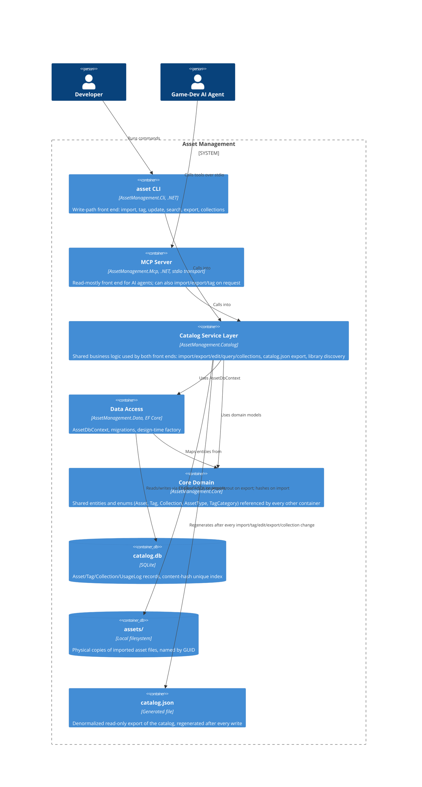

# C4: Container

## Diagram

## Description

| Container | Technology | Responsibility |
|---|---|---|
| `asset` CLI | .NET, Spectre.Console.Cli | Human-driven write path. Commands live under `Commands/` (`ImportAssetCommand`, `ExportAssetCommand`, `TagAssetCommand`, `UpdateAssetCommand`, `SearchAssetCommand`, `ShowAssetCommand`, `ExportCatalogCommand`, `InitCommand`, plus `Commands/Collection/*` for collection management). Also owns `asset init`, which runs *before* library-root discovery to bootstrap a new library. |
| MCP Server | .NET, `ModelContextProtocol` SDK, stdio transport | Agent-facing surface. A single `AssetTools` class exposes import/export/search/get/collection tools. All logging is routed to stderr rather than stdout, since stdout carries the JSON-RPC protocol stream itself. |
| Catalog Service Layer | .NET | Owns all business logic, shared by both front ends so behavior never diverges between CLI and MCP: `AssetImportService`, `AssetExportService`, `AssetEditService`, `AssetQueryService`, `CollectionService`, `CatalogExporter`, plus `LibraryDiscovery`/`LibrarySettings` for resolving the library root (`.assetlibrary` marker or `ASSET_LIBRARY_ROOT`). |
| Data Access | .NET, EF Core, SQLite provider | `AssetDbContext` (schema + Fluent API config) and its migrations. `Database.Migrate()` is invoked automatically on every startup (`ServiceCollectionExtensions.AddAssetLibrary`), so schema upgrades apply transparently — no manual migration step for end users. |
| Core Domain | .NET | Entities (`Asset`, `Tag`, `AssetTag`, `Collection`, `CollectionAsset`, `UsageLog`) and enums (`AssetType`, `TagCategory`) shared by every other container — the one dependency every layer has in common. |
| `catalog.db` | SQLite file | The system of record. Lives at `<libraryRoot>/catalog/catalog.db`. |
| `assets/` | Local filesystem | The system of record for file *bytes*. Each file is named `{guid}_{slugified-name}{ext}` under `<libraryRoot>/assets/`. |
| `catalog.json` | Generated file | A denormalized, read-only snapshot of the catalog at `<libraryRoot>/catalog/catalog.json`, regenerated by `CatalogExporter` after every mutating operation. Not a source of truth — always derived from `catalog.db`. |

All five .NET containers are compiled into two deployable artifacts: the `asset` CLI executable and the `AssetManagement.Mcp` executable, both self-contained single-file publishes for Windows and Linux (see `PLAN-PUBLISH.md` at the repo root for the packaging/installer approach). `catalog.db`, `assets/`, and `catalog.json` are not separate deployables — they're the on-disk state a library root contains.
