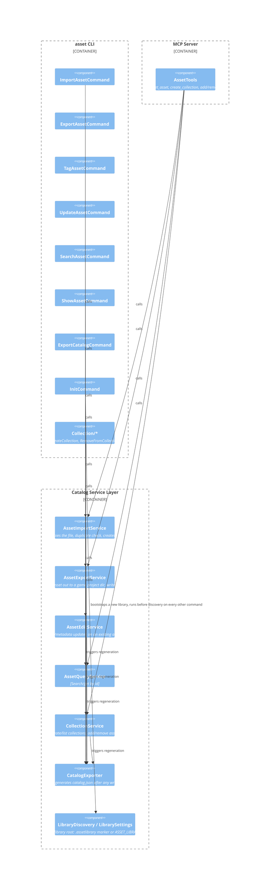

# C4: Component

## Diagram

## Description

### `asset` CLI components
Thin command classes (Spectre.Console.Cli) — each parses its own arguments/options, calls exactly one Catalog service method, and formats the result as a table or `[red]Error:[/]` markup. No business logic lives here.

| Component | Calls into | Notes |
|---|---|---|
| `ImportAssetCommand` | `AssetImportService` | Catches `FileNotFoundException` and `InvalidOperationException` (duplicate content) explicitly. |
| `ExportAssetCommand` | `AssetExportService` | |
| `TagAssetCommand`, `UpdateAssetCommand` | `AssetEditService` | Catch `KeyNotFoundException` for an unknown asset id. |
| `SearchAssetCommand`, `ShowAssetCommand` | `AssetQueryService` | Read-only. |
| `ExportCatalogCommand` | `CatalogExporter` | Manual re-export trigger; normally runs automatically after writes. |
| `Collection/*` | `CollectionService` | Create/list/add-to/remove-from collections. |
| `InitCommand` | `LibraryDiscovery` / EF Core `Database.Migrate()` | The one command that runs *before* library-root discovery — bootstraps `.assetlibrary`, `assets/`, `catalog/`, and the schema for a brand-new library. |

### MCP Server components
A single `AssetTools` class (`[McpServerToolType]`) exposes one `[McpServerTool]` method per capability, each a thin wrapper calling straight into the same Catalog services the CLI uses — so behavior is identical between the human and agent front ends. Tool parameters use plain (non-nullable) types with empty-string/default sentinels rather than nullable unions, since some tool-calling models struggle to generate valid JSON against a `["string","null"]` schema.

### Catalog Service Layer components
The shared core, referenced by both front ends:

| Component | Responsibility |
|---|---|
| `AssetImportService` | Validates the source file exists, streams it into `assets/` while computing a SHA-256 content hash in the same pass, checks the hash against existing assets (rejecting with `InvalidOperationException` on a match — see [ADR 0001](../adr/0001-content-hash-duplicate-detection.md)), creates the `Asset` row and its tags, triggers a catalog re-export. |
| `AssetExportService` | Looks up an asset, copies its file into a game project directory, records a `UsageLog` entry. |
| `AssetEditService` | Applies tag changes or metadata updates to an existing asset without re-importing. |
| `AssetQueryService` | Search (by tag/type/name, paginated) and get-by-id, backing both CLI search/show and MCP `search_assets`/`get_asset`. |
| `CollectionService` | Create/list collections, add/remove assets from a collection. |
| `CatalogExporter` | Regenerates `catalog.json` from `catalog.db` — the one place that keeps the denormalized export in sync; called after every mutating operation across every service. |
| `LibraryDiscovery` / `LibrarySettings` | Resolves the active library root (`ASSET_LIBRARY_ROOT` env var, falling back to walking up from the working directory for a `.assetlibrary` marker) and derives `AssetsPath`/`DbPath` from it. |

Not broken out further here: `AssetManagement.Data` (just `AssetDbContext` + EF Core migrations — see [02-container.md](02-container.md)) and `AssetManagement.Core` (plain entity/enum definitions with no behavior).
